# Voting Platform

A full-stack election management platform for small organizations, alumni associations, clubs, and similar groups.

The platform provides separate admin and voter flows. Admins can manage elections, candidates, voters, CSV imports, turnout tracking, and results publishing. Voters can log in with email OTP, access an active ballot, vote once, and view results only after the election is closed.

Built with **ASP.NET Core Web API**, **React**, **TypeScript**, and **PostgreSQL**.

---

## Live Demo

- Frontend App: [https://votingplatform2026.netlify.app/](https://votingplatform2026.netlify.app/)
- Backend API: [https://voting-platform-production.up.railway.app/](https://voting-platform-production.up.railway.app/)

> OpenAPI is available in development only. It is intentionally not exposed as a public production documentation page.

---

## Demo Access

For security reasons, production credentials are not committed to the repository.

To test the project locally:

1. Run the backend and frontend.
2. Apply database migrations.
3. Seed development data.
4. Use the seeded admin account from local configuration.
5. Use a seeded voter email to request an OTP.
6. In development, the OTP can be checked from the backend console/logs.

---

## Architecture Diagram

A high-level overview of the application architecture:

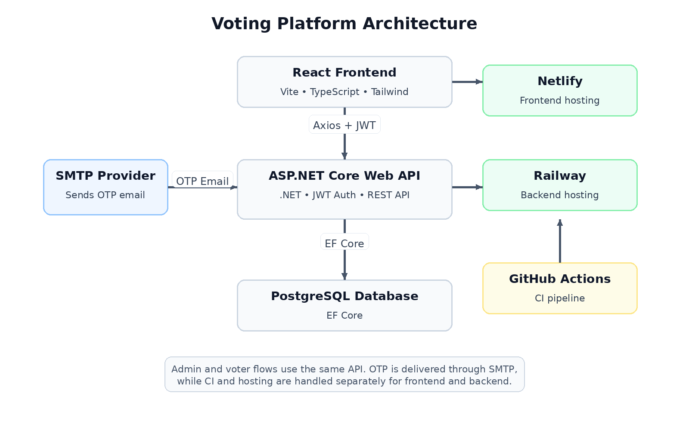

---

## Screenshots

### Voter Flow

| Email Login                                                  | OTP Verification                                     |
| ------------------------------------------------------------ | ---------------------------------------------------- |
| 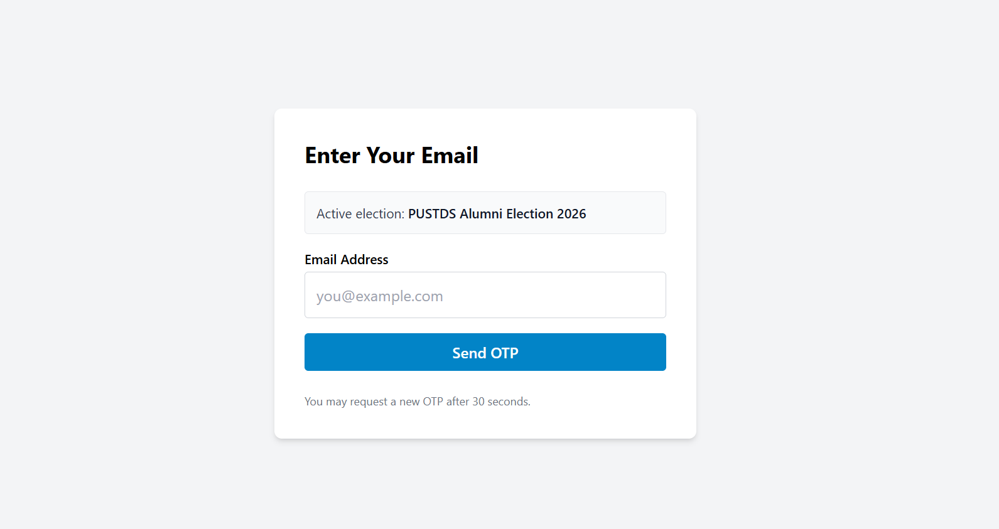 | 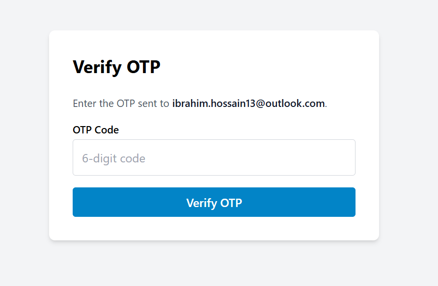 |

| Ballot                                           | Vote Success                                       |
| ------------------------------------------------ | -------------------------------------------------- |
| 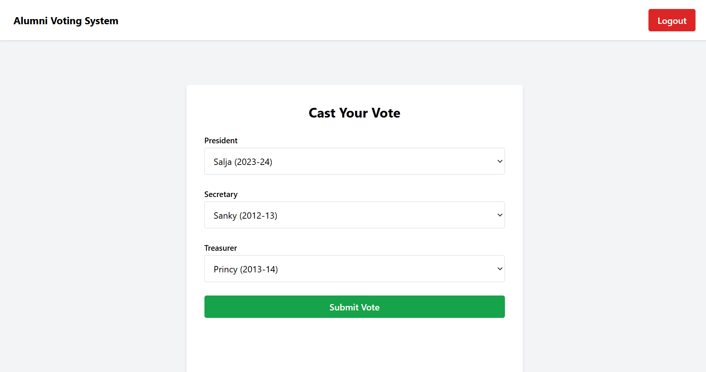 | 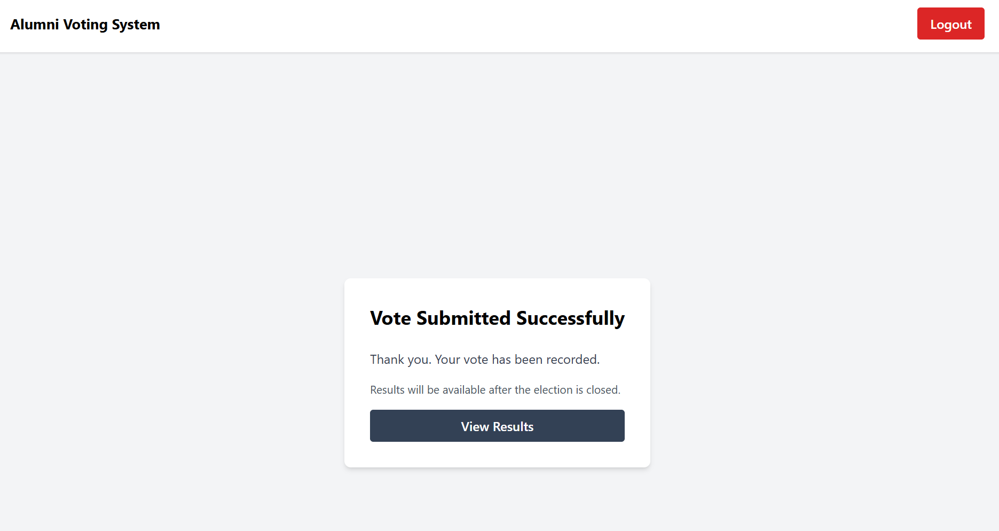 |

### Admin Flow

| Admin Login                                      | Admin Dashboard                                          |
| ------------------------------------------------ | -------------------------------------------------------- |
| 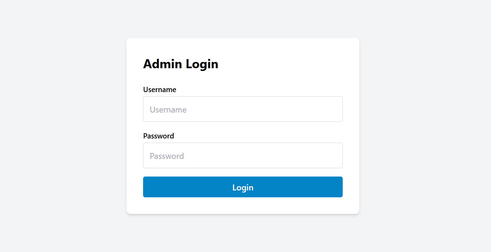 | 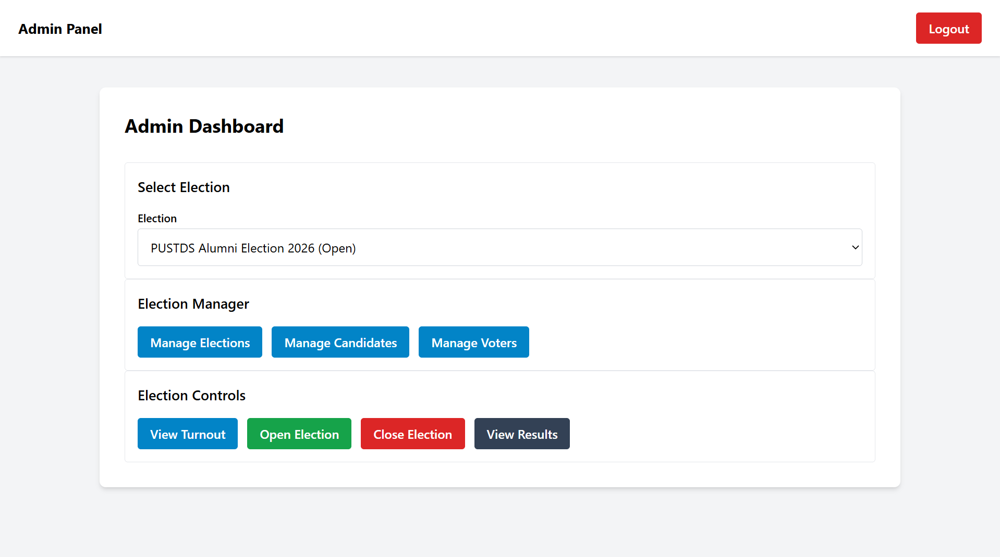 |

| Manage Elections                                           | Manage Candidates                                            |
| ---------------------------------------------------------- | ------------------------------------------------------------ |
| 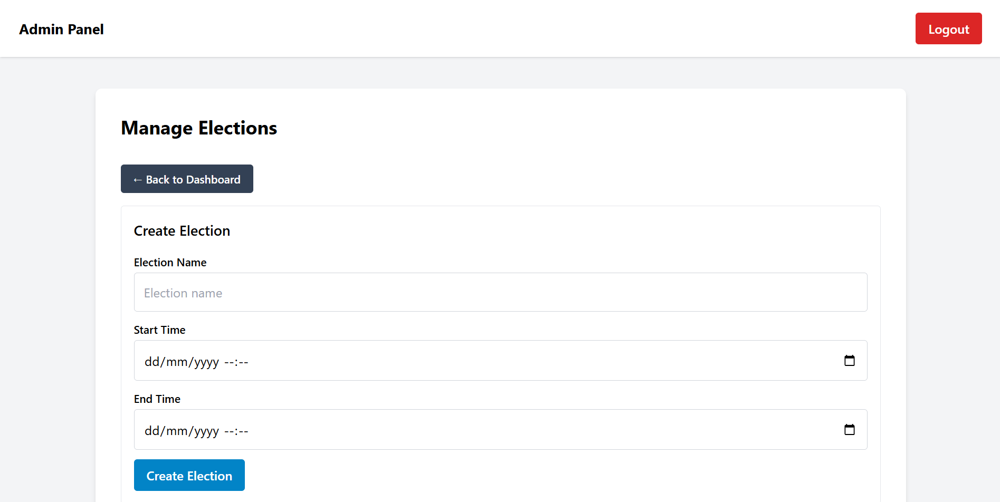 | 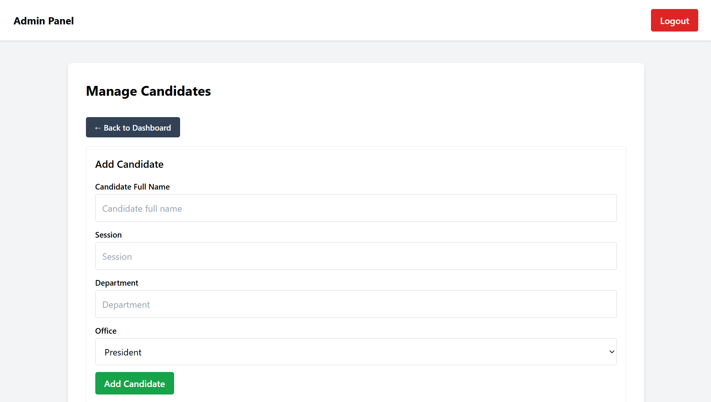 |

| Manage Voters                                        | Election Results                                           |
| ---------------------------------------------------- | ---------------------------------------------------------- |
| 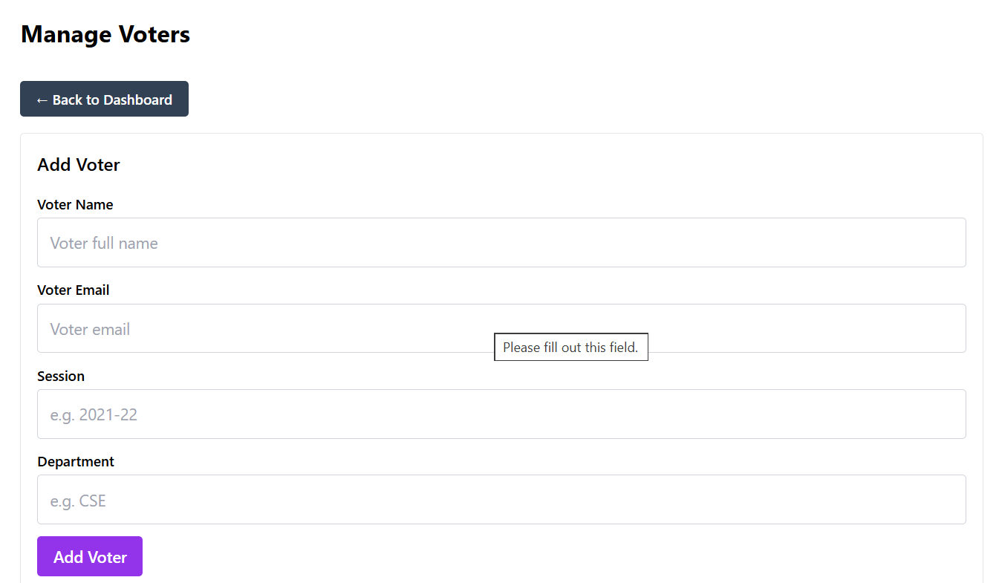 | 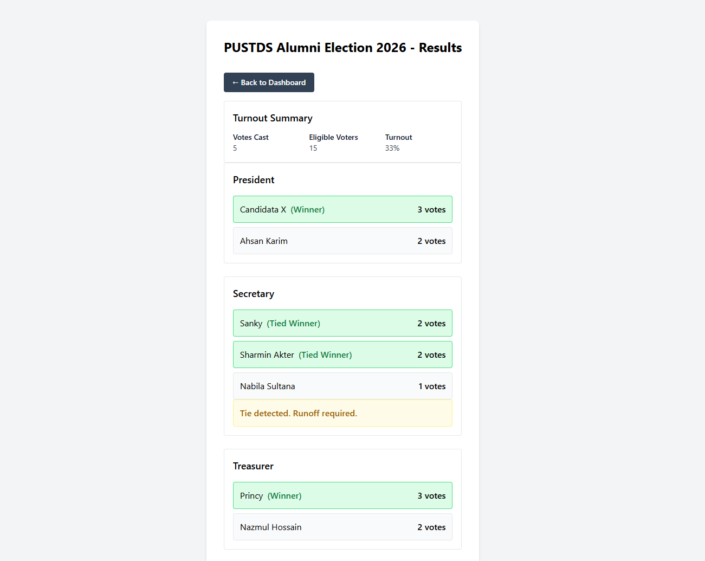 |

---

## Key Features

### Admin Features

- JWT-based admin authentication
- Create and manage elections
- Add candidates manually
- Add voters manually
- Import candidates from CSV
- Import voters from CSV
- View paginated election, candidate, and voter lists
- Open and close elections
- Track voter turnout
- Publish results only after an election is closed

### Voter Features

- Email-based OTP login
- Access to the active election ballot
- One-time ballot submission
- Server-side duplicate vote prevention
- Results hidden while the election is open
- Results visible after the election is closed
- Mobile-friendly voting experience

---

## Core Election Rules

- A voter can submit only one ballot per election.
- A voter must vote for one candidate per office.
- Results remain hidden while the election is open.
- Results become visible only after the election is closed.
- Duplicate voting is prevented on the server side.
- Ballot submission is separated from voter identity to support secret voting.

---

## Tech Stack

### Backend

- ASP.NET Core Web API
- .NET 10
- Entity Framework Core
- PostgreSQL
- JWT authentication
- BCrypt password hashing
- SMTP email delivery for OTP
- OpenAPI in development

### Frontend

- React 19
- TypeScript
- Vite
- React Router
- Axios
- Tailwind CSS

### DevOps and Deployment

- Docker Compose
- GitHub Actions CI
- Railway backend deployment
- Netlify frontend deployment

---

## Project Structure

```text
voting-platform/
├── .github/
│   └── workflows/                  # CI workflows
│
├── backend/
│   ├── Voting.Api/
│   │   ├── Common/                 # Shared helpers and constants
│   │   ├── Contracts/              # Request and response DTOs
│   │   ├── Controllers/            # API endpoints
│   │   ├── Domain/                 # Entities and enums
│   │   ├── Extensions/             # Service registration and config extensions
│   │   ├── Infrastructure/         # DbContext, persistence, email, and auth services
│   │   ├── Migrations/             # EF Core migrations
│   │   ├── Program.cs
│   │   └── Voting.Api.csproj
│   │
│   └── VotingPlatform.slnx
│
├── frontend/
│   └── voting-ui/
│       ├── src/
│       │   ├── app/                # App-level routing and setup
│       │   ├── features/           # Feature-based frontend modules
│       │   │   ├── admin/          # Admin dashboard and management pages
│       │   │   ├── auth/           # Login, OTP, and auth context
│       │   │   ├── results/        # Election results flow
│       │   │   └── voter/          # Ballot flow
│       │   ├── layouts/            # Shared layouts
│       │   └── shared/             # Shared API, UI components, hooks, and utilities
│       │
│       ├── package.json
│       └── vite.config.ts
│
├── docs/
│   ├── architecture/               # Architecture diagram
│   ├── postman/                    # Postman collection and environment
│   └── screenshots/                # README screenshots
│
├── .env.example                    # Environment variable template
├── docker-compose.yml
└── README.md
```

---

## Frontend Architecture

The frontend follows a feature-based structure. Most major features use this pattern:

```text
types -> api -> hooks -> components -> pages
```

Example:

```text
features/admin/candidates/
├── api/
├── components/
├── hooks/
├── pages/
└── types/
```

This structure keeps the frontend easier to maintain:

- `api/` contains backend API calls
- `hooks/` contain feature-specific state and actions
- `components/` contain feature-specific UI
- `pages/` compose full pages
- `types/` contain TypeScript contracts
- `shared/ui/` contains reusable UI components such as buttons, cards, alerts, tables, pagination, and dialogs

---

## Backend Architecture

The backend is organized around API, domain, and infrastructure boundaries:

- `Controllers/` expose HTTP endpoints
- `Contracts/` define request and response models
- `Domain/` contains entities and enums
- `Infrastructure/` contains persistence, services, authentication, email delivery, and database concerns
- `Extensions/` keeps `Program.cs` clean by grouping service registration

The backend uses environment-based configuration for database connection, JWT, CORS, OTP, email, and seed behavior.

---

## How the Application Works

### Admin Flow

1. Admin logs in.
2. Admin creates an election.
3. Admin adds candidates and voters manually or by CSV upload.
4. Admin opens the election.
5. Admin monitors voter turnout.
6. Admin closes the election.
7. Results become available.

### Voter Flow

1. Voter enters their email.
2. The system sends an OTP.
3. Voter verifies the OTP.
4. Voter accesses the ballot.
5. Voter submits votes for all offices.
6. Voter is redirected to the success page.
7. Voter can view results after the election is closed.

---

## Local Development

### Prerequisites

- .NET 10 SDK
- Node.js 20 or newer
- PostgreSQL
- Docker, optional but recommended

---

### 1. Clone the repository

```bash
git clone https://github.com/ibs13/voting-platform.git
cd voting-platform
```

---

### 2. Backend setup

```bash
cd backend/Voting.Api
dotnet restore
dotnet ef database update
dotnet run
```

In development, OpenAPI is available at:

```text
/openapi
```

Backend configuration should be provided through environment variables or local user secrets.

Minimum required backend values:

```text
ConnectionStrings__Default
Jwt__Key
Cors__AllowedOrigins__0
```

---

### 3. Frontend setup

```bash
cd frontend/voting-ui
npm install
npm run dev
```

Useful frontend scripts:

```bash
npm run dev       # start local development server
npm run build     # run TypeScript build and Vite production build
npm run lint      # run ESLint
npm run preview   # preview production build locally
```

---

## Environment Variables

The repository includes a root `.env.example` file for production-style configuration.

### Backend variables

```text
ASPNETCORE_ENVIRONMENT
ASPNETCORE_URLS
ConnectionStrings__Default
Jwt__Key
Jwt__Issuer
Jwt__Audience
Jwt__VoterTokenMinutes
Jwt__AdminTokenHours
Cors__AllowedOrigins__0
Otp__ExpiryMinutes
Otp__MaxAttempts
Election__TimeZone
Seed__RunOnStartup
Email__Provider
Email__SmtpHost
Email__SmtpPort
Email__SmtpUsername
Email__SmtpPassword
Email__SenderEmail
Email__SenderName
Email__SmtpUseStartTls
```

Never commit real secrets, database URLs, SMTP credentials, JWT secrets, or production credentials.

---

## CSV Import

Admins can upload voters and candidates by CSV.

Expected voter CSV columns:

```text
email,name,session,department
```

Expected candidate CSV columns:

```text
fullname,session,department,office
```

The backend validation rules and API contracts are the source of truth if the data model changes.

---

## API Reference

OpenAPI is generated in development.

```text
/openapi
```

The production backend does not expose a public OpenAPI page. This keeps production cleaner and avoids exposing internal API details unnecessarily.

---

## API Testing

A Postman collection is available under:

```text
docs/postman
```

Recommended manual API testing flow:

1. Admin login
2. Create election
3. Add or import candidates
4. Add or import voters
5. Open election
6. Request voter OTP
7. Verify voter OTP
8. Submit ballot
9. Close election
10. View results

---

## Docker Compose

A `docker-compose.yml` file is included for local container-based setup.

Typical usage:

```bash
docker compose up --build
```

The Compose setup is intended for local development and production-style testing.

---

## Deployment Notes

Before deploying, verify:

- PostgreSQL connection string is configured
- JWT secret is configured and strong enough
- CORS origin points to the real frontend domain
- SMTP credentials are configured for OTP delivery
- seed behavior is disabled unless intentionally needed
- frontend API base URL points to the deployed backend

Current deployment targets:

- Backend: Railway
- Frontend: Netlify

---

## Development Notes

### Path casing matters

GitHub Actions runs on Linux, so folder and file casing must match imports exactly.

For example, this import:

```ts
import { CandidateTable } from "@/features/admin/candidates/components/CandidateTable";
```

requires the folder to be named exactly:

```text
components
```

not:

```text
Components
```

This is especially important when developing on Windows, where local builds may pass even if casing is wrong.

---

## Current Codebase Focus

This project is currently focused on:

- cleaner backend layering
- feature-based frontend structure
- reusable frontend UI components
- role-based separation between admin and voter flows
- production-ready environment configuration
- safer deployment setup
- clear portfolio-level documentation

---

## Recommended Future Improvements

Planned improvements:

- Add more screenshots or GIFs for important user flows
- Add sample CSV files under a `samples/` or `docs/` folder
- Add backend pagination for larger voter and candidate datasets
- Add stronger result visualization
- Add automated backend tests
- Add automated frontend tests
- Add a public demo guide with safe demo data

---

## License

MIT
